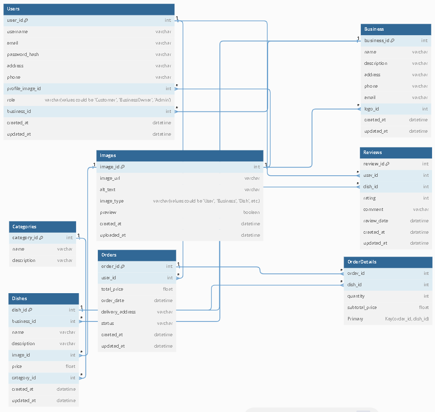

Table Users {
  user_id int [pk, increment]
  username varchar
  email varchar [unique]
  password_hash varchar
  address varchar
  phone varchar
  profile_image_id int [ref: > Images.image_id]
  role varchar (values could be 'Customer', 'BusinessOwner', 'Admin')
  business_id int [ref: > Business.business_id]  // Only filled if role is 'BusinessOwner'
  created_at datetime
  updated_at datetime
}

Table Images {
  image_id int [pk, increment]
  image_url varchar [unique]
  alt_text varchar
  image_type varchar (values could be 'User', 'Business', 'Dish', etc.)
  preview boolean
  created_at datetime
  uploaded_at datetime
}

Table Business {
  business_id int [pk, increment]
  name varchar
  description varchar
  address varchar
  phone varchar
  email varchar [unique]
  logo_id int [ref: > Images.image_id]
  created_at datetime
  updated_at datetime
}

Table Categories {
  category_id int [pk, increment]
  name varchar
  description varchar
}

Table Dishes {
  dish_id int [pk, increment]
  business_id int [ref: > Business.business_id]
  name varchar
  description varchar
  image_id int [ref: > Images.image_id]
  price float
  category_id int [ref: > Categories.category_id]
  created_at datetime
  updated_at datetime
}

Table Orders {
  order_id int [pk, increment]
  user_id int [ref: > Users.user_id]
  total_price float
  order_date datetime
  delivery_address varchar
  status varchar
  created_at datetime
  updated_at datetime
}

Table OrderDetails {
  order_id int [ref: > Orders.order_id]
  dish_id int [ref: > Dishes.dish_id]
  quantity int
  subtotal_price float
  Primary Key (order_id, dish_id)
}

Table Reviews {
  review_id int [pk, increment]
  user_id int [ref: > Users.user_id]
  dish_id int [ref: > Dishes.dish_id]
  rating int
  comment varchar
  review_date datetime
  created_at datetime
  updated_at datetime
}

